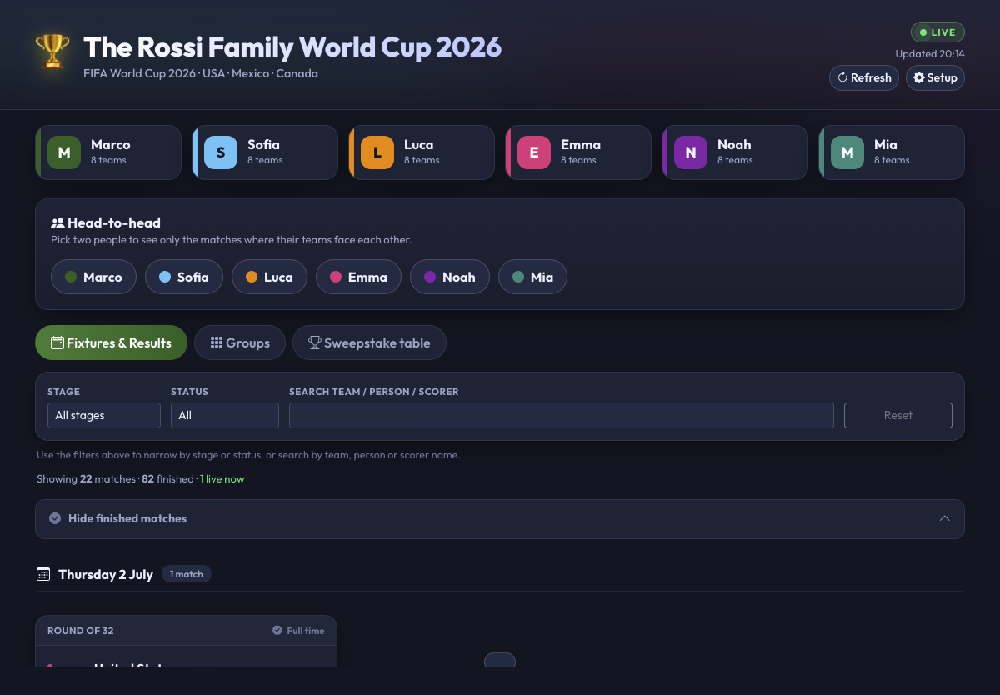
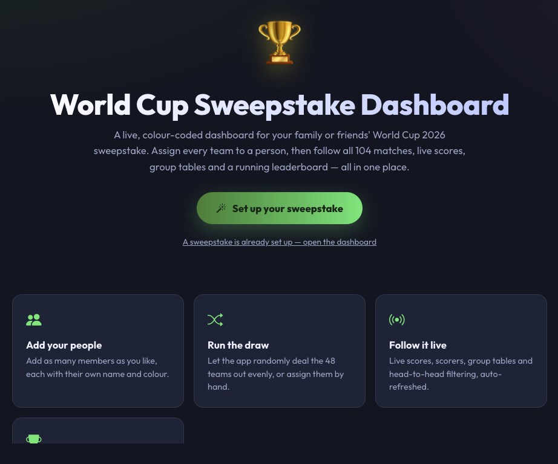
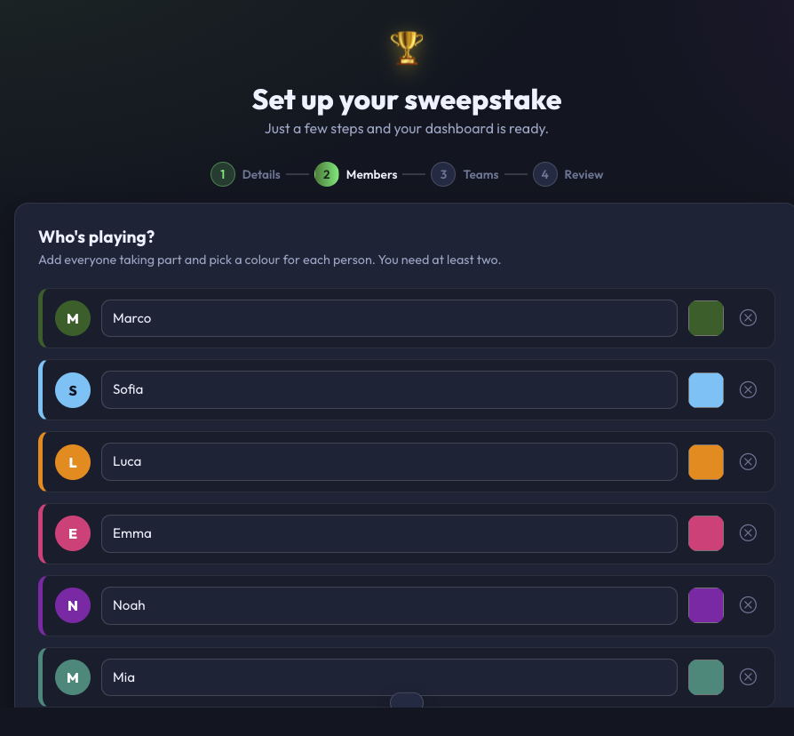
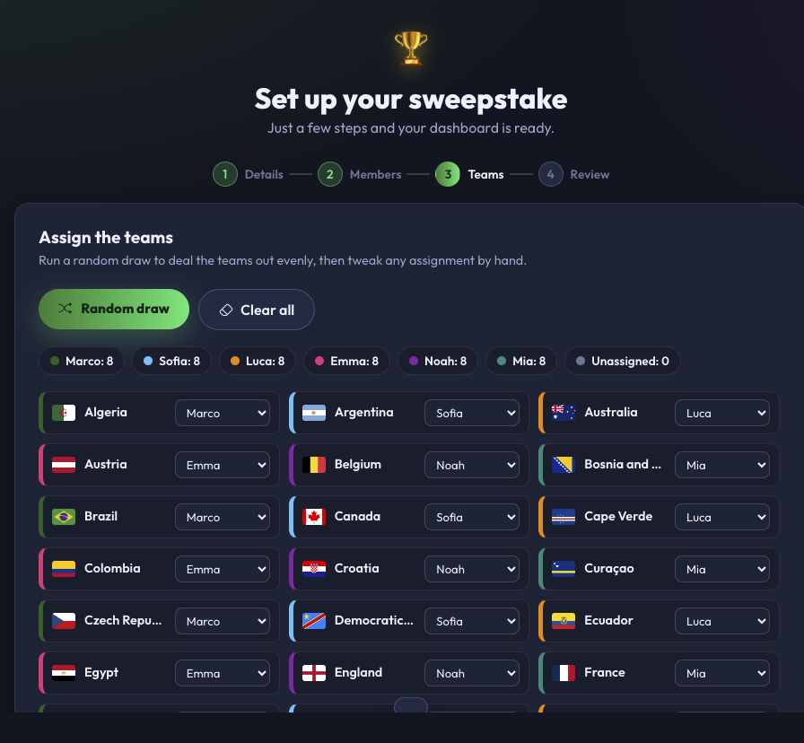
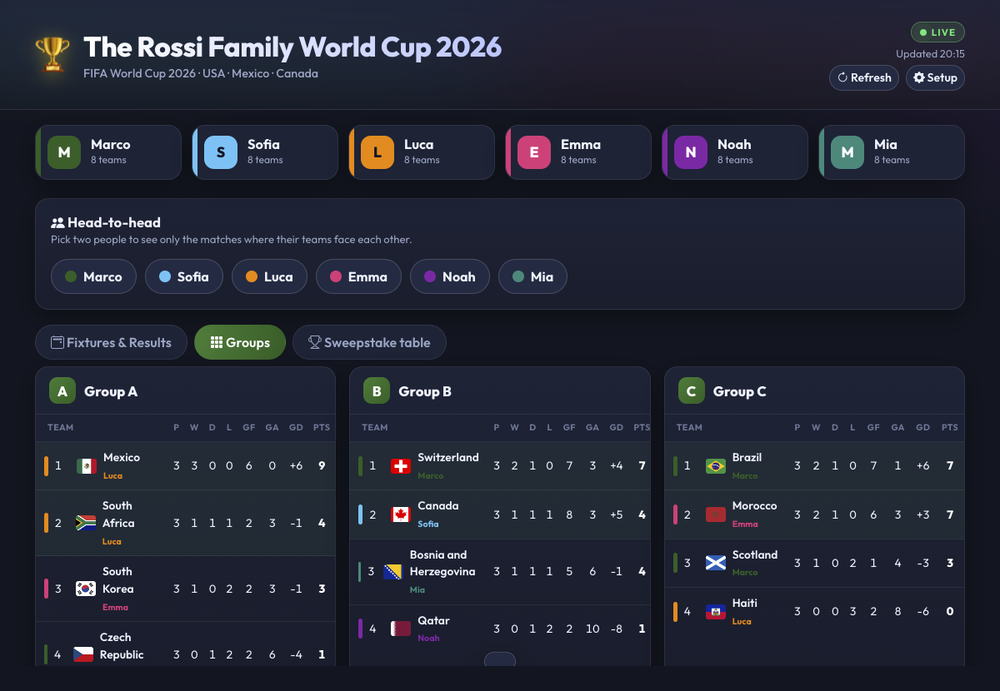
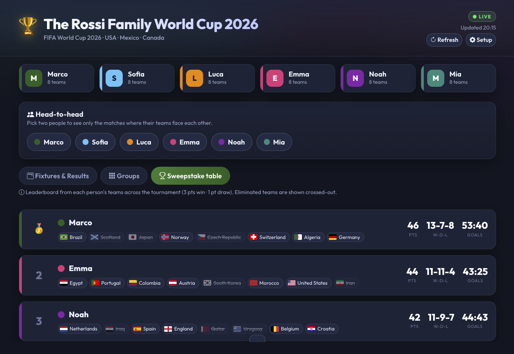
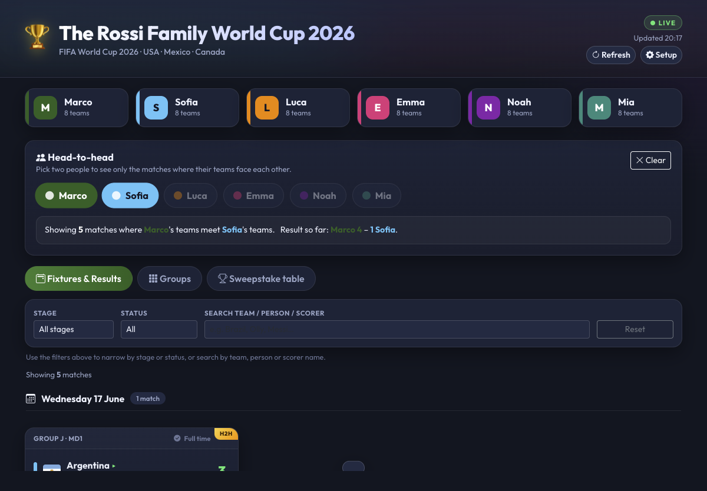

<div align="center">

# 🏆 World Cup Sweepstake Dashboard

**A live, colour-coded dashboard for running a World Cup 2026 sweepstake with your family or friends.**

Assign every team to a person, then follow all 104 matches, live scores, group tables
and a running leaderboard — all in one place. Fully configurable in-app: no code editing
required.




</div>

---

## ✨ What it does

Everyone in your group is given a colour and a set of teams. As the tournament plays out,
the dashboard tints every fixture, group table and standings row to its owner so you can
see at a glance how each person is doing — live.

On first run you're taken through a short **setup wizard**: name your sweepstake, add your
people (with colours), and either run a **random draw** or assign the 48 teams by hand.
Your configuration is stored on the server and shared with everyone who visits.

## 🖼️ Screenshots

### First-run welcome

<p align="center">
  
</p>

### Setup wizard — add your people & run the draw

<p align="center">
  
  
</p>

### Fixtures, groups & leaderboard

<p align="center">
  
</p>

<p align="center">
  
</p>

### Head-to-head

Pick any two people to see only the matches where their teams meet, plus a running win tally.

<p align="center">
  
</p>

## 🌟 Features

- **First-run setup wizard** — a guided flow (welcome → setup) to create your sweepstake:
  tournament name, members & colours, and team assignment.
- **Random draw or manual assignment** — shuffle and deal the 48 teams out evenly, or
  pick each team's owner from a dropdown. Mix and match.
- **Any number of members** — add as many people as you like, each with their own colour.
  Readable text and accent colours are derived automatically for good contrast.
- **Colour-coded ownership** — every team flag, fixture and standings row is tinted to
  its owner.
- **All 104 fixtures & results** — group stage through to the final, shown as
  country-vs-country cards grouped by day, with live scores, goal-scorers, venue and
  match status (Upcoming · Live · Full time).
- **Live auto-refresh** — scores refresh every 30 seconds (and on demand). A server-side
  cache with stale-while-revalidate keeps the upstream API happy and first loads fast.
- **Head-to-head filter** — click any two people to see only the matches where their
  teams play each other, with a running win tally.
- **Groups view** — full group tables computed live (P, W, D, L, GF, GA, GD, Pts) with the
  top two highlighted.
- **Sweepstake leaderboard** — ranks members by their teams' combined results
  (3 pts win · 1 pt draw), with knockout-eliminated teams crossed out.
- **Import / export / reset** — back up or share your configuration as a JSON file, or
  start over at any time.
- **Responsive, modern UI** — Bootstrap 5 + a custom dark theme. No build step.

## 🚀 Getting started

**Requirements:** Node.js 18 or newer.

```bash
# 1. Install dependencies
npm install

# 2. Start in development mode (auto-reload)
npm run dev

# …or start normally
npm start
```

Then open **http://localhost:3050**.

On first visit (no configuration saved yet) you'll be sent to the welcome page and then
the setup wizard. Once you save, the dashboard launches with your sweepstake.

To use a different port: `PORT=4000 npm start`.

## 🧭 Setting up your sweepstake

The setup wizard has four steps:

1. **Details** — name your sweepstake (shown at the top of the dashboard) and an optional subtitle.
2. **Members** — add everyone taking part and pick a colour for each. You need at least two.
3. **Teams** — click **Random draw** to deal the 48 teams out evenly, then tweak any
   assignment from the per-team dropdown. Live per-member counts keep you on track.
4. **Review & save** — check everything, then save to launch the dashboard.

To reconfigure later, click the **Setup** (gear) button in the dashboard header, or go to
`/setup.html` directly. You can also **export** your setup to a JSON file and **import** it
elsewhere, or **start over** to wipe the configuration.

## ⚙️ Configuration & storage

Your sweepstake configuration is stored **server-side**, shared across everyone who visits
the server, in a single JSON file:

```
data/config.json
```

This file is created by the setup wizard and is **git-ignored**, so every deployment starts
fresh with its own welcome/setup flow. The shape is:

```jsonc
{
  "tournamentName": "The Rossi Family World Cup 2026",
  "subtitle": "FIFA World Cup 2026 · USA · Mexico · Canada",
  "members": [
    { "id": "m1", "name": "Marco", "colour": "#1b5e20", "text": "#ffffff", "accent": "#2e7d32" }
  ],
  "ownership": { "Argentina": "m1" },
  "updatedAt": "2026-07-02T18:40:05.222Z"
}
```

> **Note on access:** the config write endpoints are unauthenticated (fine for private
> family use). If you deploy this on the public internet and want to stop strangers
> overwriting your setup, add a simple passphrase check to the `PUT`/`DELETE`
> `/api/config` handlers in [`server.js`](server.js).

## 🔌 API endpoints

**Configuration**

| Method   | Endpoint      | Description                                             |
|----------|---------------|--------------------------------------------------------|
| `GET`    | `/api/config` | Current config, or `{ "configured": false }` if unset  |
| `PUT`    | `/api/config` | Validate & save a configuration                        |
| `DELETE` | `/api/config` | Reset (start over)                                     |

**Proxied upstream data (cached)**

| Method | Endpoint         | Description                    | Cache |
|--------|------------------|--------------------------------|-------|
| `GET`  | `/api/games`     | All 104 matches                | 25s   |
| `GET`  | `/api/teams`     | 48 teams                       | 1h    |
| `GET`  | `/api/groups`    | Group standings                | 45s   |
| `GET`  | `/api/stadiums`  | 16 venues                      | 24h   |
| `GET`  | `/api/health`    | Server health + cache state    | –     |

## 🛠️ Tech stack

- **Node.js + Express** server — serves the front-end, stores the config, and proxies the
  live API to avoid browser CORS issues, with a short in-memory cache.
- **HTML + Bootstrap 5 + vanilla JS** front-end — no build step, no framework.
- **nodemon** for hot-reload during development.

## 📁 Project structure

```
World_Cup_Dashboard/
├── server.js              # Express server + cached API proxy + config store
├── package.json
├── data/
│   └── config.json        # Saved sweepstake config (created at runtime, git-ignored)
├── public/
│   ├── welcome.html       # First-run landing page
│   ├── setup.html         # Setup wizard
│   ├── index.html         # Dashboard layout
│   ├── css/
│   │   ├── styles.css     # Theme & components
│   │   └── setup.css      # Welcome + setup styling
│   └── js/
│       ├── config.js      # Runtime config loader + colour helpers
│       ├── setup.js       # Setup wizard logic
│       └── app.js         # Data loading, rendering, filters
├── docs/
│   └── screenshots/       # Images used in this README
├── LICENSE
└── README.md
```

## 📡 Data source

Live match data comes from the free [worldcup26.ir](https://worldcup26.ir/?lang=en) REST API
([source](https://github.com/rezarahiminia/worldcup2026)). This project is not affiliated
with FIFA or the data provider.

## 🤝 Contributing

Contributions are welcome! See [CONTRIBUTING.md](CONTRIBUTING.md) for how to get set up and
open a pull request.

## 📄 License

Released under the [MIT License](LICENSE).
